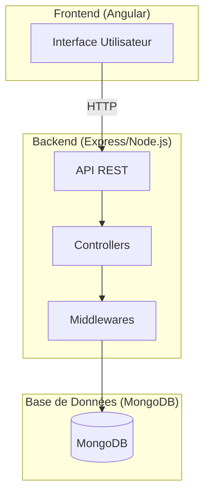
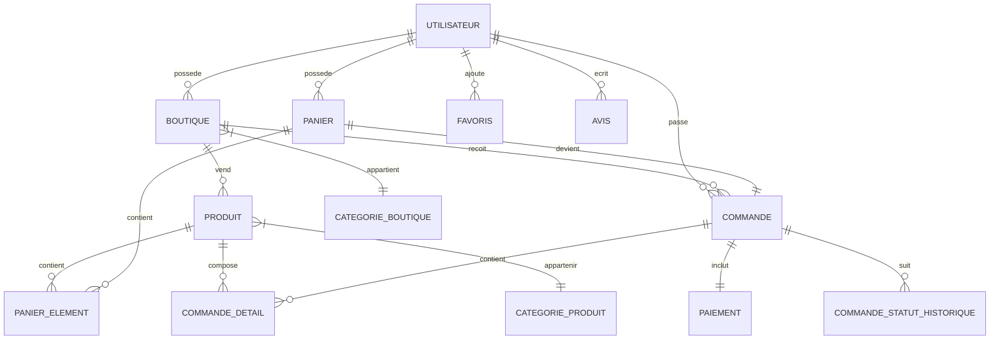
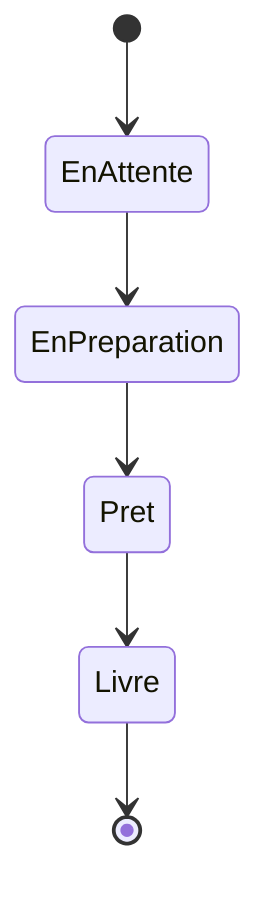
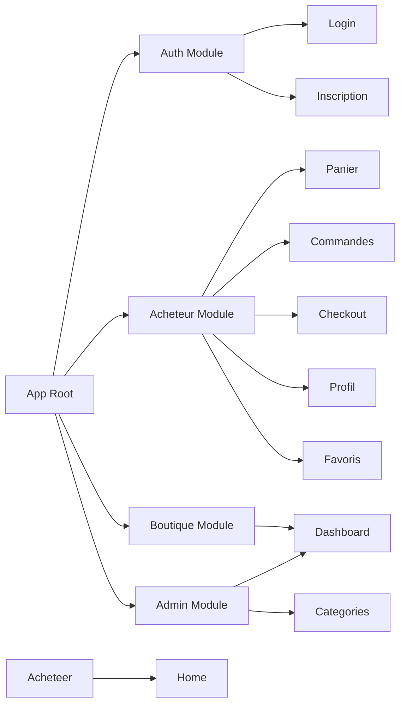

# Documentation du Projet - Centre Commercial MEAN

## 1. Présentation Générale du Projet

Ce projet est une application web de centre commercial développée avec la stack MEAN (MongoDB, Express.js, Angular, Node.js). Il s'agit d'une plateforme e-commerce multi-utilisateurs permettant la gestion complète d'un centre commercial avec trois rôles distincts.

### 1.1 Architecture du Projet



### 1.2 Structure des Données



### 1.3 Stack Technologique

| Couche | Technologie |
|--------|-------------|
| Frontend | Angular 19 |
| Backend | Node.js + Express.js |
| Base de données | MongoDB + Mongoose |
| Authentification | JWT (JSON Web Token) |
| Upload de fichiers | Multer |
| Validation | Express Validator |

---

## 2. Rôles et Utilisateurs

L'application propose trois types de rôles :

| Rôle | Description | Route |
|------|-------------|-------|
| `admin_centre` | Administrateur du centre commercial | `/admin` |
| `boutique` | Gérant d'une boutique | `/boutique` |
| `acheteur` | Client final | `/acheteur` |

---

## 3. Fonctionnalités par Rôle

### 3.1 RÔLE ADMINISTRATEUR DU CENTRE COMMERCIAL

L'administrateur est le super-utilisateur de la plateforme. Il gère l'ensemble du centre commercial.

#### 3.1.1 Tableau de Bord Administrateur

**Route:** [`/admin/dashboard`](projet/src/app/features/admin/dashboard/admin-dashboard.component.html)

Le tableau de bord admin affiche les statistiques globales du centre commercial :

- **Nombre total de boutiques** - Compteur de toutes les boutiques enregistrées
- **Nombre de boutiques actives** - Boutiques actuellement en fonctionnement
- **Nombre d'acheteurs** - Total des comptes clients
- **Nombre total de commandes** - Commandes passées sur la plateforme
- **Chiffre d'affaires global** - Somme totale des revenus
- **Boutique la plus active** - Boutique avec le plus de commandes
- **Produits les plus vendus** - Top produits par quantité

#### 3.1.2 Gestion des Boutiques

**Route:** [`/admin/gestion-boutiques`](projet/src/app/features/admin/gestion-boutiques/categories/liste-categories/liste-categories.component.html)

L'admin peut effectuer les opérations CRUD complètes sur les boutiques :

| Fonctionnalité | Description |
|----------------|-------------|
| **Créer une boutique** | Ajout avec nom, description, catégorie, logo, date de création |
| **Modifier une boutique** | Mise à jour de toutes les informations |
| **Supprimer une boutique** | Suppression définitive du système |
| **Associer un compte** | Lier un compte utilisateur à la boutique |

#### 3.1.3 Activation / Désactivation des Boutiques

**Contrôle:** [`admin.controller.js`](Express/src/controllers/admin.controller.js)

| Statut | Visibilité | Commandes |
|--------|------------|-----------|
| **Activée** | Visible pour les acheteurs | Acceptées |
| **Désactivée** | Invisible | Refusées |

#### 3.1.4 Gestion des Catégories de Boutiques

**Routes:**
- Liste: [`/admin/gestion-boutiques/categories/liste`](projet/src/app/features/admin/gestion-boutiques/categories/liste-categories/liste-categories.component.html)
- Création: [`/admin/gestion-boutiques/categories/creer`](projet/src/app/features/admin/gestion-boutiques/categories/creer-categorie/creer-categorie.component.html)
- Modification: [`/admin/gestion-boutiques/categories/modifier/:id`](projet/src/app/features/admin/gestion-boutiques/categories/modifier-categorie/modifier-categorie.component.html)

#### 3.1.5 Gestion des Utilisateurs

**Contrôle:** [`utilisateur.controller.js`](Express/src/controllers/utilisateur.controller.js)

| Action | Description |
|--------|-------------|
| Voir la liste | Filtrer par rôle (admin, boutique, acheteur) |
| Créer un compte | Ajouter un nouveau compte boutique |
| Activer/Désactiver | Gérer l'accès à la plateforme |
| Réinitialiser le mot de passe | Intervention admin en cas de oubli |

---

### 3.2 RÔLE BOUTIQUE

Le gérant de boutique gère une boutique spécifique au sein du centre commercial.

#### 3.2.1 Tableau de Bord Boutique

**Route:** [`/boutique/dashboard`](projet/src/app/features/boutique/dashboard/boutique-dashboard.component.html)

Le tableau de bord boutique affiche les statistiques personnelles :

- **Nombre de commandes reçues** - Total des commandes clients
- **Chiffre d'affaires** - Revenus de la boutique
- **Produits les plus vendus** - Top 5 des produits
- **Historique des ventes** - Évolution des commandes

#### 3.2.2 Gestion des Produits

**API:** [`produit.routes.js`](Express/src/routes/produit.routes.js)

| Opération | Paramètres |
|-----------|------------|
| **Créer un produit** | Nom, prix, description, stock, image, catégorie |
| **Modifier un produit** | Mise à jour de cualquier champ |
| **Supprimer un produit** | Suppression définitive |
| **Activer/Désactiver** | Gestion de la disponibilité |

#### 3.2.3 Gestion des Commandes

**API:** [`commande.routes.js`](Express/src/routes/commande.routes.js)

Suivi et mise à jour du statut des commandes :



| Statut | Description |
|--------|-------------|
| En attente | Commande nouvellement passée |
| En préparation | Boutique en cours de préparation |
| Prêt | Commande prête pour retrait/livraison |
| Livré | Commande remise au client |

#### 3.2.4 Gestion du Profil

- Modification des informations de la boutique
- Changement du mot de passe
- Mise à jour du logo/image

---

### 3.3 RÔLE ACHETEUR (CLIENT FINAL)

L'acheteur est l'utilisateur final qui effectue des achats dans le centre commercial.

#### 3.3.1 Authentification

**Routes:**
- Connexion: [`/auth/login`](projet/src/app/features/auth/components/login/login.component.html)
- Inscription: [`/auth/inscription`](projet/src/app/features/auth/components/inscription/inscription.component.html)

| Fonctionnalité | Description |
|----------------|-------------|
| Inscription | Création d'un nouveau compte client |
| Connexion | Authentification avec email/mot de passe |
| Déconnexion | Fin de session |

#### 3.3.2 Consultation des Boutiques

**Route:** [`/acheteur/home`](projet/src/app/features/acheteur/home/home.component.html)

| Fonctionnalité | Description |
|----------------|-------------|
| Liste des boutiques | Affichage des boutiques actives uniquement |
| Filtrage par catégorie | Recherche par catégorie de boutique |
| Détails d'une boutique | Vue complète avec produits |

#### 3.3.3 Gestion du Panier

**Route:** [`/acheteur/panier`](projet/src/app/features/acheteur/panier/panier.component.html)

| Action | Description |
|--------|-------------|
| Ajouter un produit | Sélection avec quantité |
| Modifier la quantité | Augmentation/diminution |
| Supprimer un produit | Retrait du panier |
| Voir le total | Calcul automatique du montant |

#### 3.3.4 Passage de Commande

**Route:** [`/acheteur/checkout`](projet/src/app/features/acheteur/checkout/checkout.component.html)

Processus de commande :
1. Validation du panier
2. Vérification des informations
3. Confirmation de la commande

#### 3.3.5 Suivi des Commandes

**Routes:**
- Liste: [`/acheteur/commandes`](projet/src/app/features/acheteur/commandes/commandes.component.html)
- Détail: [`/acheteur/commande/:id`](projet/src/app/features/acheteur/commande-detail/commande-detail.component.html)

| Information | Description |
|-------------|-------------|
| Historique | Liste de toutes les commandes |
| Détail | Produits commandés, montants |
| Statut | Suivi en temps réel |

#### 3.3.6 Gestion des Favoris

**Route:** [`/acheteur/favoris`](projet/src/app/features/acheteur/favoris/favoris.component.html)

- Ajouter des produits en favoris
- Retirer des favoris
- Accéder rapidement aux produits favoris

#### 3.3.7 Profil Utilisateur

**Route:** [`/acheteur/profil`](projet/src/app/features/acheteur/profil/profil.component.html)

- Modification des informations personnelles
- Changement du mot de passe

---

## 4. Composants Frontend

### 4.1 Structure des Modules



### 4.2 Liste des Composants

| Module | Composant | Fichier |
|--------|-----------|---------|
| Auth | LoginComponent | [`login.component.ts`](projet/src/app/features/auth/components/login/login.component.ts) |
| Auth | InscriptionComponent | [`inscription.component.ts`](projet/src/app/features/auth/components/inscription/inscription.component.ts) |
| Admin | AdminDashboardComponent | [`admin-dashboard.component.ts`](projet/src/app/features/admin/dashboard/admin-dashboard.component.ts) |
| Admin | AdminSidebarComponent | [`admin-sidebar.component.ts`](projet/src/app/features/admin/components/admin-sidebar/admin-sidebar.component.ts) |
| Admin | ListeCategoriesComponent | [`liste-categories.component.ts`](projet/src/app/features/admin/gestion-boutiques/categories/liste-categories/liste-categories.component.ts) |
| Admin | CreerCategorieComponent | [`creer-categorie.component.ts`](projet/src/app/features/admin/gestion-boutiques/categories/creer-categorie/creer-categorie.component.ts) |
| Admin | ModifierCategorieComponent | [`modifier-categorie.component.ts`](projet/src/app/features/admin/gestion-boutiques/categories/modifier-categorie/modifier-categorie.component.ts) |
| Boutique | BoutiqueDashboardComponent | [`boutique-dashboard.component.ts`](projet/src/app/features/boutique/dashboard/boutique-dashboard.component.ts) |
| Acheteur | HomeComponent | [`home.component.ts`](projet/src/app/features/acheteur/home/home.component.ts) |
| Acheteur | PanierComponent | [`panier.component.ts`](projet/src/app/features/acheteur/panier/panier.component.ts) |
| Acheteur | CommandesComponent | [`commandes.component.ts`](projet/src/app/features/acheteur/commandes/commandes.component.ts) |
| Acheteur | CommandeDetailComponent | [`commande-detail.component.ts`](projet/src/app/features/acheteur/commande-detail/commande-detail.component.ts) |
| Acheteur | CheckoutComponent | [`checkout.component.ts`](projet/src/app/features/acheteur/checkout/checkout.component.ts) |
| Acheteur | ProduitDetailComponent | [`produit-detail.component.ts`](projet/src/app/features/acheteur/produit-detail/produit-detail.component.ts) |
| Acheteur | ProfilComponent | [`profil.component.ts`](projet/src/app/features/acheteur/profil/profil.component.ts) |
| Acheteur | FavorisComponent | [`favoris.component.ts`](projet/src/app/features/acheteur/favoris/favoris.component.ts) |
| Acheteur | AcheteurDashboardComponent | [`acheteur-dashboard.component.ts`](projet/src/app/features/acheteur/dashboard/acheteur-dashboard.component.ts) |
| Acheteur | AcheteurSidebarComponent | [`acheteur-sidebar.component.ts`](projet/src/app/features/acheteur/components/acheteur-sidebar/acheteur-sidebar.component.ts) |

---

## 5. API Backend

### 5.1 Routes Principales

| Module | Fichier | Description |
|--------|---------|-------------|
| Auth | [`auth.routes.js`](Express/src/routes/auth.routes.js) | Inscription, connexion, tokens |
| Utilisateurs | [`utilisateur.routes.js`](Express/src/routes/utilisateur.routes.js) | Gestion des utilisateurs |
| Boutiques | [`boutique.routes.js`](Express/src/routes/boutique.routes.js) | CRUD boutiques |
| Produits | [`produit.routes.js`](Express/src/routes/produit.routes.js) | CRUD produits |
| Catégories | [`categorieBoutique.routes.js`](Express/src/routes/categorieBoutique.routes.js) | Catégories boutiques |
| Catégories Produits | [`categorieProduit.routes.js`](Express/src/routes/categorieProduit.routes.js) | Catégories produits |
| Panier | [`panier.routes.js`](Express/src/routes/panier.routes.js) | Gestion du panier |
| Commandes | [`commande.routes.js`](Express/src/routes/commande.routes.js) | Commandes clients |
| Paiements | [`paiement.routes.js`](Express/src/routes/paiement.routes.js) | Traitement paiements |
| Statistiques | [`statistiques.routes.js`](Express/src/routes/statistiques.routes.js) | Stats personnalisées |
| Admin | [`admin.routes.js`](Express/src/routes/admin.routes.js) | Fonctions admin |
| Avis | [`avis.routes.js`](Express/src/routes/avis.routes.js) | Avis produits |
| Favoris | [`favoris.routes.js`](Express/src/routes/favoris.routes.js) | Gestion favoris |

### 5.2 Documentation API

L'API dispose d'une documentation Swagger accessible à :
```
http://localhost:3000/api-docs
```

---

## 6. Services Frontend

### 6.1 Services disponibles

| Service | Fichier | Utilisation |
|---------|---------|-------------|
| AuthService | [`auth.service.ts`](projet/src/app/core/services/auth.service.ts) | Authentification |
| TokenService | [`token.service.ts`](projet/src/app/core/services/token.service.ts) | Gestion JWT |
| BoutiqueService | [`boutique.service.ts`](projet/src/app/core/services/boutique.service.ts) | Opérations boutiques |
| ProduitService | [`produit.service.ts`](projet/src/app/core/services/produit.service.ts) | Opérations produits |
| PanierService | [`panier.service.ts`](projet/src/app/core/services/panier.service.ts) | Gestion panier |
| CommandeService | [`commande.service.ts`](projet/src/app/core/services/commande.service.ts) | Commandes |
| CategorieBoutiqueService | [`categorie-boutique.service.ts`](projet/src/app/core/services/categorie-boutique.service.ts) | Catégories |
| AvisService | [`avis.service.ts`](projet/src/app/core/services/avis.service.ts) | Avis |
| FavorisService | [`favoris.service.ts`](projet/src/app/core/services/favoris.service.ts) | Favoris |

---

## 7. Modèles de Données

### 7.1 Entités Principales

| Modèle | Fichier | Description |
|--------|---------|-------------|
| Utilisateur | [`utilisateur.model.js`](Express/src/models/utilisateur.model.js) | Utilisateurs de la plateforme |
| Role | [`role.model.js`](Express/src/models/role.model.js) | Rôles (admin, boutique, acheteur) |
| Boutique | [`boutique.model.js`](Express/src/models/boutique.model.js) | Boutiques du centre |
| CategorieBoutique | [`categorieBoutique.model.js`](Express/src/models/categorieBoutique.model.js) | Catégories de boutiques |
| Produit | [`produit.model.js`](Express/src/models/produit.model.js) | Produits en vente |
| CategorieProduit | [`categorieProduit.model.js`](Express/src/models/categorieProduit.model.js) | Catégories de produits |
| Panier | [`panier.model.js`](Express/src/models/panier.model.js) | Panier d'un client |
| PanierElement | [`panierElement.model.js`](Express/src/models/panierElement.model.js) | Élément du panier |
| Commande | [`commande.model.js`](Express/src/models/commande.model.js) | Commande client |
| CommandeDetail | [`commandeDetail.model.js`](Express/src/models/commandeDetail.model.js) | Détail d'une commande |
| Paiement | [`paiement.model.js`](Express/src/models/paiement.model.js) | Informations paiement |
| Avis | [`avis.model.js`](Express/src/models/avis.model.js) | Avis sur produits |
| Favoris | [`favoris.model.js`](Express/src/models/favoris.model.js) | Produits favoris |

---

## 8. Installation et Démarrage

### 8.1 Prérequis

- Node.js (v14+)
- MongoDB (local ou Atlas)
- Angular CLI

### 8.2 Backend

```bash
cd Express
npm install
npm start
```

Le serveur backend démarre sur `http://localhost:3000`

### 8.3 Frontend

```bash
cd projet
npm install
ng serve
```

Le serveur frontend démarre sur `http://localhost:4200`

---

## 9. Captures d'Écran et Interfaces

> **Note:** Les captures d'écran doivent être ajoutées lors de la démonstration de l'application.

### 9.1 Écrans Principaux Prévus

| Écran | Description |
|-------|-------------|
| Login | Page de connexion utilisateur |
| Inscription | Formulaire d'inscription |
| Dashboard Admin | Statistiques globales |
| Gestion Boutiques | Liste et gestion des boutiques |
| Dashboard Boutique | Stats de la boutique |
| Liste Produits | Catalogue produits |
| Panier | Panier d'achat |
| Checkout | Validation de commande |
| Historique Commandes | Suivi des commandes |
| Profil | Gestion du compte |

---

## 10. Conclusion

Ce projet MEANStack constitue une plateforme complète de centre commercial avec :

- **Gestion centralisée** par un administrateur
- **Autonomie des boutiques** pour gérer leurs produits et commandes
- **Expérience utilisateur fluide** pour les acheteurs
- **Architecture moderne** avec API REST et application monopage (SPA)

L'application est entièrement paramétrable et extensible selon les besoins du centre commercial.
